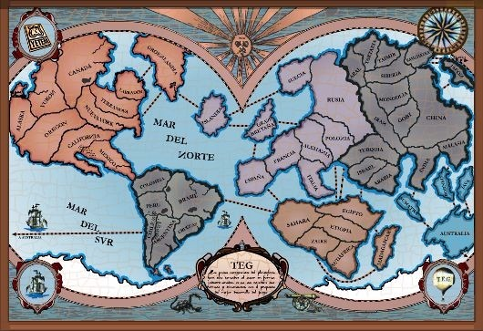

# ejemplos-de-clase-prolog

## Clase 1
Intro a lógico:
 - Definir predicados mediante hechos y reglas
 - Consultas individuales y existenciales
 - Conjunción y disyunción
 - Propiedades de relaciones binarias

Práctica: Programadores

## Clase 2

- Inversibilidad
- Negación
- Aritmética

Práctica: Lechuzas Mafiosas

## Clase 3

- Repaso: Existencia y Negación
- Para Todo

Práctica: TEG

## Clase 4

- Tipos compuestos (parte 1): Functores
- Polimorfismo

Práctica: Truco + TEG (objetivos)

## Clase 5

- Tipos compuestos (parte 2): Listas
- Agregación

Práctica: Estudiantes + TEG (cálculo de ejércitos a incorporar + refactor limítrofes)

## Clase 6

Ejercicios de Mumuki a pedido del público:
- [Se ha formado una pareja (Guía 9 - Ejercicio 5)](https://github.com/pdep-utn/mumuki-guia-logico-practica-functores-pdep-utn/blob/master/00502_Se%20ha%20formado%20una%20pareja/description.md)
- [Viajes (Guía 11 - Ejercicio 10)](https://github.com/pdep-utn/mumuki-guia-logico-practica-listas/blob/master/00004_viajes/description.md)

# Ejemplos de años anteriores

- [2019](https://github.com/pdep-mit/ejemplos-de-clase-prolog/tree/2019)
- [2018](https://github.com/pdep-mit/ejemplos-de-clase-prolog/tree/ejemplos-2018)
